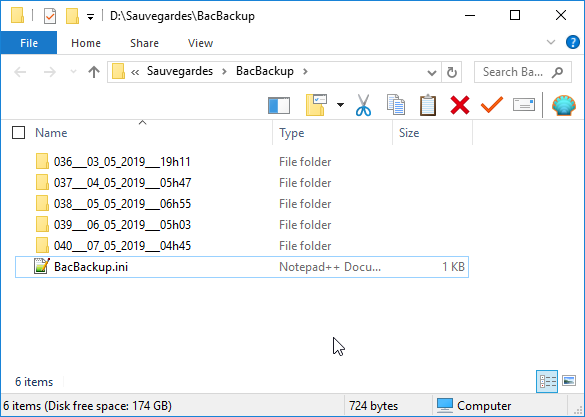
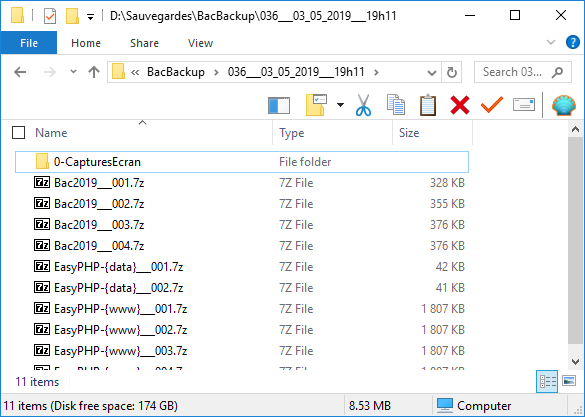

# BacBackup

**BacBackup** est un outil de sauvegarde et de surveillance conçu pour les environnements éducatifs, permettant de sauvegarder automatiquement les travaux des élèves et de capturer leur activité à l’écran dans les salles informatiques.

---

## Table des matières

- [Téléchargement](#téléchargement)
- [Principales fonctionnalités](#principales-fonctionnalités)
- [Fonctionnement détaillé](#fonctionnement-détaillé)
- [Paramètres](#paramètres)
- [Dossiers surveillés](#dossiers-surveillés)
- [Prérequis et installation](#prérequis-et-installation)

---

## Téléchargement

👉 [Télécharger la dernière version](https://github.com/romoez/BacBackup/releases)

---

## Principales fonctionnalités

- Surveillance de l'activité par captures d'écran.
- Sauvegarde périodique des dossiers surveillés :
  - Dossier de session incrémenté automatiquement à chaque démarrage.
  - Sauvegarde compressée des fichiers modifiés.
  - Stockage organisé et optimisé.

> Fig 1: Dossiers surveillés.
---

## Fonctionnement détaillé

- **Capture d’écran** toutes les 5 secondes (si activité souris/clavier).
- **Sauvegarde des dossiers** toutes les 2 minutes (si modification détectée).
- **Raccourcis clavier** :
  - `Shift + Ctrl + Win + F6` – Ouvre l’interface.
  - `Shift + Ctrl + Win + F5` – Force une sauvegarde immédiate.
- Le dossier de sauvegarde est **verrouillé** et accessible uniquement via l’interface.
- Gestion automatique de l’espace disque :
  - Suppression progressive des anciennes sauvegardes si :
    - Plus de **750 sessions** sauvegardées, ou
    - Taille totale > **200 GB**

> Fig 2: Dossier de sauvegarde créé pour chaque session, nommé avec un numéro incrémenté, la date et l’heure.

> Fig 3: Contenu d’un dossier de sauvegarde d’une session, incluant un sous-dossier pour les captures d’écran et des archives 7zip des dossiers surveillés modifiés, avec plusieurs versions.

---

## Paramètres

> Fig 4: Les options sont configurables uniquement en modifiant manuellement le fichier `BacBackup.ini`. Cette interface permet uniquement de visualiser les valeurs actuelles.

---

## Dossiers surveillés

| Dossiers                                                      | Exemples                                            |
| ------------------------------------------------------------- | --------------------------------------------------- |
| `C:\Bac*2*`                                                   | `C:\Bac2025`                                        |
| `C:\7*`                                                       | `C:\7b2`                                            |
| `C:\8*`                                                       | `C:\8ème B7`                                        |
| `C:\9*`                                                       | `C:\9 base 1`                                       |
| `C:\1*`                                                       | `C:\1s3`                                            |
| `C:\2*`                                                       | `C:\2 TI`                                           |
| `C:\3*`                                                       | `C:\3 eco 2`                                        |
| `C:\4*`                                                       | `C:\4Lettres1`                                      |
| `C:\DC*`                                                      | `C:\dc3`                                            |
| `C:\DS*`                                                      | `C:\ds 2`                                           |
| `{Bureau}\Bac*2*`                                             | `C:\Users\Eleve\Desktop\Bac2026`                    |
| `{Bureau}\7*`                                                 | `C:\Users\Eleve\Desktop\7b2`                        |
| `{Bureau}\8*`                                                 | `C:\Users\Eleve\Desktop\8ème B7`                    |
| `{Bureau}\9*`                                                 | `C:\Users\Eleve\Desktop\9 base 1`                   |
| `{Bureau}\1*`                                                 | `C:\Users\Eleve\Desktop\1s3`                        |
| `{Bureau}\2*`                                                 | `C:\Users\Eleve\Desktop\2 TI`                       |
| `{Bureau}\3*`                                                 | `C:\Users\Eleve\Desktop\3 eco 2`                    |
| `{Bureau}\4*`                                                 | `C:\Users\Eleve\Desktop\4Lettres1`                  |
| `{Bureau}\DC*`                                                | `C:\Users\Eleve\Desktop\dc3`                        |
| `{Bureau}\DS*`                                                | `C:\Users\Eleve\Desktop\ds 2`                       |
| `C:\xampp_lite*\{dossier d'hébergement d'Apache}`             | `C:\xampp_lite_8_2\www`                             |
| `C:\xampp_lite*\{dossier data de MySql/MariaDB}`              | `C:\xampp_lite_8_2\apps\mysql\data`                 |
| `C:\{ProgramFiles}\EasyPHP*\{dossier d'hébergement d'Apache}` | `C:\Program Files (x86)\EasyPHP-12.1\www`           |
| `C:\{ProgramFiles}\EasyPHP*\{dossier data de MySql/MariaDB}`  | `C:\Program Files (x86)\EasyPHP2.0b1\mysql\data` |
| `C:\EasyPHP*\{dossier d'hébergement d'Apache}`                | `C:\EasyPHP-12.1\www`                               |
| `C:\EasyPHP*\{dossier data de MySql/MariaDB}`                 | `C:\EasyPHP-x 2.0b1\mysql\data`                     |
| `C:\xampp*\{dossier d'hébergement d'Apache}`                  | `C:\xampp7.3.6\htdocs`                              |
| `C:\xampp*\{dossier data de MySql/MariaDB}`                   | `C:\xampp7.3.6\mysql\data`                          |
| `C:\Wamp*\{dossier d'hébergement d'Apache}`                   | `C:\wamp 2.5x32\www`                                |
| `C:\Wamp*\{dossier data de MySql/MariaDB}`                    | `C:\wamp 2.5x32\bin\mysql\mysql5.6.17\data`         |

> L’astérisque `*` est utilisé comme joker : il correspond à n’importe quel texte ou chiffre après le préfixe indiqué.

---

## Prérequis et installation

- **Système d’exploitation** :  
  ✅ Windows 11  
  ✅ Windows 10  
  ✅ Windows 8.1 / 8  
  ✅ Windows 7  
  ✅ Windows XP

- **Espace disque** :  
  🔹 Minimum recommandé : **Plus de 10 GB** pour éviter les suppressions automatiques trop fréquentes.

> 💡 *Note : L’installateur ne crée aucun raccourci sur le bureau ni dans le menu Démarrer. Utilisez les raccourcis clavier pour accéder à l’interface.*